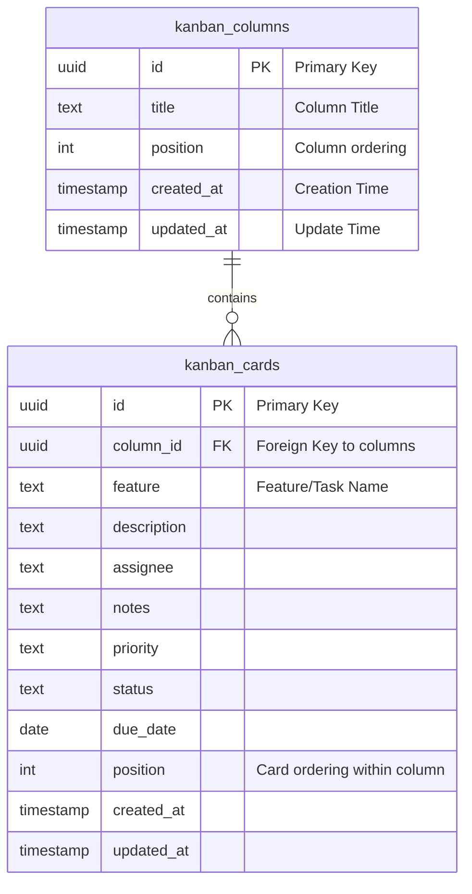

# Supabase KanbanSync Schema Setup

## Overview

This document explains how to initialize your Supabase database with tables for a Kanban board, featuring **columns** and **cards**, suited for the Kavia KanbanSync app.

---

## 1. SQL Schema Summary

- **kanban_columns**: represents board columns (e.g., "To Do", "In Progress").
  - `id`: UUID primary key
  - `title`: Column name/title
  - `position`: Integer for display order
  - `created_at`, `updated_at`: Timestamps

- **kanban_cards**: represents feature cards/tasks belonging to columns
  - `id`: UUID primary key
  - `column_id`: FK to `kanban_columns.id` (cascade on delete)
  - Fields: `feature`, `description`, `assignee`, `notes`, `priority`, `status`, `due_date`, `position`
  - `created_at`, `updated_at`: Timestamps

- Cards are ordered within columns by `position`.

---

## 2. Entity-Relationship Diagram

See `supabase_kanban_schema_diagram.mmd` (Mermaid format):

---

## 3. Applying the Schema in Supabase

### Create the Tables

1. **Open Supabase Studio**: Go to your project dashboard.
2. **Navigate to SQL Editor**: Choose SQL Editor from the left sidebar.
3. **Paste Schema**: Copy the contents of `supabase_schema_kanban.sql` and paste into a new query.
4. **Run the SQL**: Click "RUN" to execute and create your tables.

### Example

- All cards require a column (`column_id`)—delete a column, and all its cards are deleted (CASCADE).
- Use UUIDs for scalability and to support client-generated keys.

---

## 4. Usage Notes & Best Practices

- When adding new columns or cards, always provide a `position`.
- Use `updated_at` to detect changes for optimistic updates/syncing.
- You can enable Supabase Row Level Security (RLS) as needed, but this schema is single-board/single-user—add auth if your app requires private boards/users.
- Any mass reordering (e.g., drag-and-drop) should update `position` fields.
- To reset or wipe demo data, truncate both tables.
- For bulk uploads, insert multiple rows to `kanban_cards` referencing their `column_id`.
- The `column_id` foreign key is set to CASCADE deletes for simple board maintenance.

### Supabase-Specific Tips

- Use the Supabase JavaScript SDK for all CRUD operations in your React app for real-time sync.
- Postgres triggers are used to keep `updated_at` in sync automatically.
- All timestamps (created/updated) use timezone-aware UTC.

---

## 5. Common Gotchas

- **Position Management**: Ensure all `position` values are unique within their context (column/cards).
- **CASCADE Deletes**: Be cautious—deleting a column will delete ALL cards in that column.
- **UUID Generation**: If inserting from a client, you may provide the UUID or let Supabase/Postgres assign it.
- **Date Consistency**: Use `date` (not `timestamp`) for `due_date` to avoid time confusion in frontend logic.
- **Row Level Security**: If enabling, ensure policies allow your expected reads/writes.

---

## 6. Exporting

You can export board data as CSV or Excel from Supabase or your client, mapping the columns per the schema described above for consistency with bulk-upload features.

---

**For questions/updates, edit `supabase_schema_kanban.sql` and re-apply as needed.**
