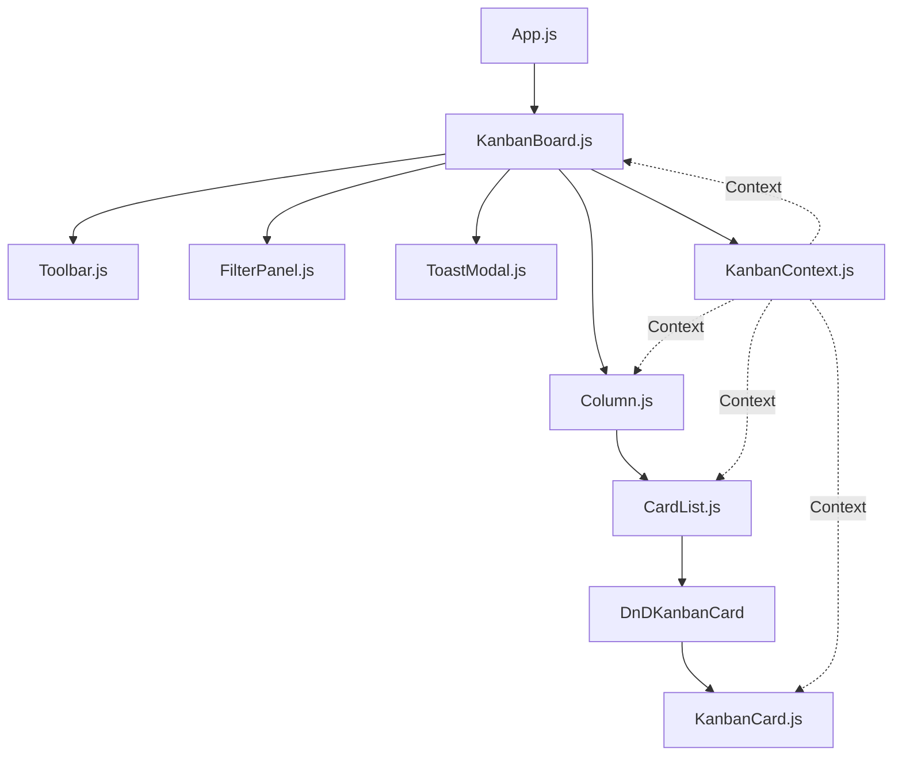

# Kavia KanbanSync Codebase - Architecture & UI Analysis

## Overview

This document provides a comprehensive architectural and UI/theming analysis of the `kavia_kanbansync` codebase. The analysis covers the overall structure, main React components, state management, directory layout, approaches to theming, and key dependencies. The intent is to guide future UI modifications and ensure maintainability as the application evolves.

---

## Directory Structure

The main directory for the React frontend is:

```
Kavia-kanban/
  └── kavia_kanbansync/
         ├── README.md
         ├── SUPABASE_SCHEMA_SETUP.md
         ├── eslint.config.mjs
         ├── package.json
         ├── ...
         ├── src/
         │    ├── App.js, App.css
         │    ├── KanbanBoard.js, KanbanBoard.css, KanbanBoard.filter.test.js
         │    ├── KanbanContext.js
         │    ├── kanbanSupabase.js
         │    ├── components/
         │    │    ├── CardList.js
         │    │    ├── Column.js
         │    │    ├── FilterPanel.js, FilterPanel.css
         │    │    ├── KanbanCard.js
         │    │    ├── ToastModal.js
         │    │    ├── Toolbar.js
         │    │    └── dndTypes.js
         │    ├── index.js, index.css
         │    ├── logo.svg
         │    └── setupTests.js
         ├── supabase_schema_kanban.sql
         └── supabase_kanban_schema_diagram.mmd
```

Key observations:
- The codebase adopts a standard single-page React structure with all logic under `src/`.
- `components/` contains modular UI components that form the Kanban board.
- Dedicated CSS files per major UI part (e.g., `App.css`, `KanbanBoard.css`, `FilterPanel.css`).
- Supabase integration logic and schema/provisioning details are included, reflecting tight integration with a managed Postgres backend.

---

## Main Modules and Component Hierarchy

#### Application Bootstrap

- **`index.js`**: Entry point that renders `<App />` into the root DOM node, imports `index.css` for global base styles.
- **`App.js`**: Defines the application shell, including the top navigation bar and the main content area, with `KanbanBoard` as the primary board UI.

#### Kanban Board System

- **`KanbanBoard.js`**:
  - The application's core visual component, providing board-level logic and orchestrating columns, filters, toolbars, and feedback (toast) UIs.
  - Uses React DnD for drag-and-drop (via `react-dnd` and `react-dnd-html5-backend`).
  - Hosts filters (via `FilterPanel`), board toolbar (via `Toolbar`), and renders draggable columns.
  - Provides context (`FeedbackContext`) for global notifications like toasts.

- **`KanbanContext.js`**:
  - React Context for board and card state (columns, cards, CRUD operations).
  - Centralizes Supabase API calls for fetching, mutation, real-time updates via channels for columns and cards.
  - Makes state (and CRUD methods) available to all descendant components through `<KanbanProvider>`.

- **`components/Toolbar.js`**: Toolbar above the board with controls for adding columns, bulk upload (Excel), and downloading templates. Handles modals for new columns and upload workflows.

- **`components/FilterPanel.js`**: Provides grouped, accessible filter controls to select/match cards by assignee, priority, status, column, or due date. Uses local React state, communicates changes upward.

- **`components/Column.js`**: Represents a single Kanban column. Handles display of the column title (with inline editing), modal for delete/rename, and renders a `CardList` for the column's cards.

- **`components/CardList.js`**: Manages the list of cards for a column, supports vertical card reordering within a column and drag-and-drop operations.

- **`components/KanbanCard.js`**: Visual and functional representation of a single task card. Includes a compact/card view, and an expanded modal for details and editing. Handles pill/badge rendering for status/priority/assignee.

- **`components/ToastModal.js`**: Custom lightweight toast UI using React Portals for global error/success/info messages from any part of the board.

- **DnD Types (`dndTypes.js`)**: Exports drag-and-drop type constants to coordinate DnD logic between cards and columns.

#### State Management

- **State Management Pattern:**  
  - Centralized in `KanbanContext.js` using React's Context API.
  - Holds top-level state: list of board columns, list of cards, and loading/error flags.
  - All CRUD and board/card mutations route through context methods, which in turn call Supabase via `kanbanSupabase.js`.
  - Provides real-time updates using Supabase channels for live collaboration (via the JS SDK).

- **Supabase Integration:**
  - All backend communication occurs via the `@supabase/supabase-js` client (`kanbanSupabase.js`).
  - Real-time database changes (inserts/updates/deletes) are reflected in the UI automatically.

---

## UI Structure and Component Hierarchy

```
<App>
  <nav> ... </nav>
  <KanbanBoard>
    <Toolbar />
    <FilterPanel />
    <div className="kanban-board">
        <Column>
          <CardList>
            <DnDKanbanCard>
              <KanbanCard> (compact view <-> modal edit/detail)
            </DnDKanbanCard>
            ...
          </CardList>
          ...
        </Column>
        ...
    </div>
    <ToastModal /> (portal, global)
  </KanbanBoard>
</App>
```
- **Modal dialogs** (for editing/adding cards/columns, and for toasts) use ReactDOM portals for correct overlay layering.
- The Kanban board is visually the main area, horizontally scrolling on mobile, responsive flexbox on desktop.
- The Toolbar and FilterPanel are sticky above the board.
- The application is fully responsive and touch-optimized.

---

## Theming and Visual Design

**Theme Style:**
- The design is _dark, modern, and minimal_, with a strong KAVIA brand accent color scheme.
- No external heavy CSS/UI frameworks are used; all styling is defined via `App.css`, `KanbanBoard.css`, and component-level CSS.

**Colors:**
- The palette is defined using CSS variables in `App.css` (see README excerpt):
  - Accent: `--color-accent: #38cfcf;` and related.
  - Background/fill: several variables for panels/cards/overlays.
  - Card-state and pill/badge coloring is mapped by status/priority using intuitive pastel coding for accessible, high-contrast visuals.

**CSS Approach:**
- Emphasizes CSS custom properties (variables) for semantic and maintainable theming.
- Common reusable styles for buttons, containers, typography.
- Responsive breakpoints tuned for usability on desktop and mobile.

**Accessibility:**
- All major controls and modals have ARIA/labeling and keyboard focus management.
- Sufficient color contrast (WCAG AA per comments in `App.css`).
- Keyboard navigation for DnD supported in columns.

---

## Main Dependencies

- **Core:**
  - `react`, `react-dom`: UI.
  - `react-scripts`: Build tooling.
- **Drag-and-drop:**
  - `react-dnd`, `react-dnd-html5-backend`: Handles all DnD, both for columns and cards.
- **Data and Backend:**
  - `@supabase/supabase-js`: All CRUD and real-time sync.
- **Other:**
  - `xlsx`: Excel import/export for bulk task management.
- **Linting/Testing:**
  - ESLint via a modern config (see `eslint.config.mjs`).
  - Some Jest unit tests (see `KanbanBoard.filter.test.js`, `setupTests.js`).

---

## Summary Table: Key App Concerns

| Concern               | How Addressed                                       |
|---------------------- | --------------------------------------------------- |
| State Management      | Centralized React Context, Context API              |
| Data Persistence      | Supabase Postgres with real-time synchronization    |
| Drag & Drop           | React DnD (cards, columns reorderings)              |
| Filtering/Grouping    | Local state + UI filter panel, flexible logic       |
| Theming/Design        | Pure CSS, dark modern, semantic variables           |
| Responsiveness        | Mobile-first, adaptive via CSS media queries        |
| Modals/Toasts         | Custom React Portals, high UX polish                |
| Accessibility (a11y)  | Labels, focus management, ARIA, color contrast      |
| Bulk Input/Export     | XLSX file import/export, mapped to schema           |

---

## Areas for UI Modification

- **App-wide Themes:** Well-defined theme/variable organization; global palette is easily extended/modified in `App.css`.
- **Componentization:** The code is cleanly broken into modular, focused components to allow easy refactoring and visual changes.
- **Board Customization/Feature Additions:** Any new card/column UI (fields, visual states) can be managed at the component and CSS variable layer with minimal risk of breakage.
- **Modals/Dialogs/Portals:** All overlays (edit dialogs, toasts) use the same system, ensuring consistency for further UI extensions.
- **Real-time Feedback:** Toast system is decoupled and global, easy to enhance or swap.
- **Filter/Toolbar Extensibility:** Already set up for additional filters, advanced sorting, or bulk operations.

---

## Mermaid Diagram: High-Level Component Hierarchy



---

## Conclusion

The Kavia KanbanSync React frontend codebase is a modern, highly modular and accessible SPA, structured for easy extension and visual customization, with state and persistence handled cleanly through a Context provider and Supabase integration. All theming and UX polish is managed via custom properties and modular CSS, ensuring minimal effort for future UI/theming initiatives.

---

**Sources:**  
- `Kavia-kanban/kavia_kanbansync/package.json`  
- `Kavia-kanban/kavia_kanbansync/README.md`  
- `Kavia-kanban/kavia_kanbansync/src/App.js`, `App.css`  
- `Kavia-kanban/kavia_kanbansync/src/KanbanBoard.js`, `KanbanBoard.css`  
- `Kavia-kanban/kavia_kanbansync/src/KanbanContext.js`  
- `Kavia-kanban/kavia_kanbansync/src/components/Toolbar.js`  
- `Kavia-kanban/kavia_kanbansync/src/components/FilterPanel.js`, `FilterPanel.css`  
- `Kavia-kanban/kavia_kanbansync/src/components/Column.js`  
- `Kavia-kanban/kavia_kanbansync/src/components/CardList.js`  
- `Kavia-kanban/kavia_kanbansync/src/components/KanbanCard.js`  
- `Kavia-kanban/kavia_kanbansync/src/components/ToastModal.js`  
- `Kavia-kanban/kavia_kanbansync/src/components/dndTypes.js`  
- `Kavia-kanban/kavia_kanbansync/src/kanbanSupabase.js`  
- `Kavia-kanban/kavia_kanbansync/src/index.js`, `index.css`
