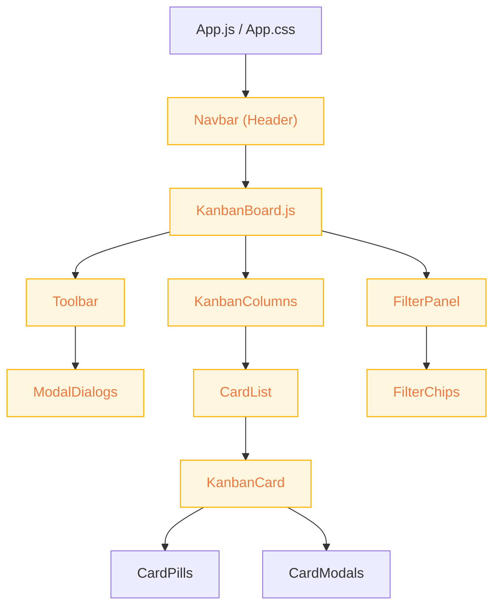

# UI Theme Gap & Component Coverage Analysis – Kavia KanbanSync

## Purpose
This document analyzes all UI components and layouts in the Kavia KanbanSync React frontend for:
- Alignment with the **intended "light orange/half white, minimal, modern" theme**
- Visual and interaction consistency across the application
- Identification of outdated styles or incomplete areas
- Gaps in component coverage (missing UI/UX elements essential for an optimal Kanban experience)

**Sources:**  
- `src/App.js`, `App.css`
- `src/KanbanBoard.js`, `KanbanBoard.css`
- `src/components/Toolbar.js`
- `src/components/FilterPanel.js`, `FilterPanel.css`
- `src/components/Column.js`
- `src/components/CardList.js`
- `src/components/KanbanCard.js`
- `src/components/ToastModal.js`
- `src/index.css`

---

## 1. Theme Consistency: Light Orange/Half White Modern Design

### Global Theming
- The intent (as seen in `App.css` and `App.js` custom theme) is a light, minimal palette with orange accents, white/off-white backgrounds, and modern rounded minimal UI.
- The CSS variables cover most use cases: `--color-bg-main: #fffdf7`, `--color-bg-surface: #fff6e0`, `--color-accent: #ffb300` are used throughout for backgrounds and main elements. Shadows and border radius variables enhance modern depth.
- The **navbar** uses the correct palette in both style and variable references.

#### Observed Consistencies
- Most major surfaces (backgrounds, panels, cards) use a white or off-white (`#fffdf7`/`#fff6e0`) background.
- Accent and interactive states draw from orange/yellow/faintly gold shades as appropriate.
- The card badges (pills) and chips use pastel oranges and high-contrast color mapping.
- Toolbar, filter panel and modal dialogs are consistent in their variable usage (and override backgrounds when custom).
- Most form controls (inputs, buttons, selects, chips) use consistent style and transition variables.

#### Observed Inconsistencies / Issues
- **Some modals and card detail views**: Internally, some card modals use background colors (`#1a2554`, `#242d46` for forms/sections) that are noticeably darker (legacy style) and break from the half-white/soft orange motif.
- **Compact card title/desc colors**: Titles often use `#fff` or similar, which on a light card may contrast weakly (if the card bg isn't customized by state).
- **Some chip/pill-badge variants**: "Assignee" and "Due" badge backgrounds (`#21293F`, `#273953`) lean dark blue/indigo and could be tweaked for better harmony with rest of the light palette.  
- **Card detail modal sections**: The "Notes" or similar containers are dark blue backgrounds, which stands out from the app's white/cream focus.

#### Opportunities for Improvement
- Unify all modals and form containers onto variants of `--color-bg-modal` and pastel oranges. Remove remaining usage of hardcoded dark colors for any backgrounds.
- Audit all pill/chip backgrounds so that no "blue/indigo" elements remain unless specifically required for state contrast (e.g., "info/warning"). Favor the pastel-light accent approach instead.

---

## 2. Visual Consistency and Completeness

### Strengths
- The board, toolbar, columns and cards structure are visually and functionally consistent. Components use CSS variables and style mixing well, maintaining a minimal, accessible look.
- All sections are responsive with appropriate media queries.
- Drag-and-drop cues and states are well handled visually (borders, shadows).

### Issues/Visual Gaps
- **Add/Edit Form Containers (kanban-add-card-form, kanban-edit-card-form):**  
  - These use a legacy blue background (`background: #1a2554`) in both `App.css` and `KanbanBoard.css`. This stands out against the rest of the very light palette and can be visually jarring. These should adopt a softer, lighter background (e.g., `--color-bg-modal` or a related pastel variant).
- **Popover overlays** (modals, toasts):  
  - Generally consistent, but error states use a very bright red or blue, which may be a bit strong. The toast modal bg also uses a dark blue, but this is less of a problem since it overlays the pale board.
- **Small headings/text:**  
  - Color use for text sometimes falls to hardcoded white or blue instead of referencing semantic variables (review all — use `--color-text-main`, `--color-text-secondary` for body text and headings on light backgrounds).

---

## 3. UI/UX Feature Gaps or Missing Kanban Essentials

### Complete/Present:
- **Core Kanban Features**: Columns, drag-and-drop (cards & columns), add/edit/delete, multi-column UI, filter panel, bulk card management (via Excel), and toasts for notifications.
- **Filters**: Assignee/priority/status/column/due date, with multi-selects and chips.
- **Accessibility**: Reasonable focus management, keyboard navigation, ARIA labels throughout.
- **Responsive Layout**: Flexbox & media queries for mobile/desktop.

### Areas Needing Attention or Improvement:
- **Board/Workspace context:** There is no visual board selection/management UI (e.g., board switcher, sidebar, or workspace identifier). If multi-board support is intended (per product description), this is missing.
- **User menu/authentication UI:** The header mentions "AI Board", but there is no user menu or authentication UI evident. While this may be under future development, for a Kanban SaaS, a user account menu is generally present in the nav.
- **Onboarding/empty states:** It is unclear if empty board/column states have dedicated illustrations or friendly messages when there are no columns/cards yet. These improve first-time UX.
- **Customization options:** Theme toggle (dark mode), personal color palette, or custom branding per board are not surfaced.
- **Side panel/actions drawer:** There is no sidebar for board navigation, global settings, or activity stream as sometimes seen in full-featured Kanban apps.
- **Card attachments/comments:** There’s no visual for file attachments, checklist, or card comments, though these may not be in scope for MVP.

---

## 4. Sections That Appear Outdated or Incomplete

- **Legacy dark backgrounds:** Any usage of `#1a2554`, `#242d46`, or similar in form containers, card modals, or section/field boxes should be replaced with light theme variables for full aesthetic consistency.
- **Text color defaults:** Hardcoded colors like `#fff`, `#acdffc`, `#6efbdf` should migrate to text semantic variables unless they are deliberate highlights.
- **Legacy CSS classes (`.subtitle`, `.description`, etc.):** All should be reviewed to ensure correct text colors per theme.

---

## 5. Recommendations (Actionable)

**Theme Remediation:**
- Refactor background and section colors in modals/forms to consistently use the new orange/pastel variables (`--color-bg-modal`, `--color-bg-surface`, etc.).
- Adjust pill, badge, and chip backgrounds that use blues/indigos to draw from the accent palette.
- Ensure all primary/secondary/caption/heading typography references semantic variables, not hardcoded colors.

**UI/UX Feature Next Steps:**
- Plan or surface board/workspace context affordances (even if MVP is single-board).
- Add onboarding visuals or friendly copy for empty boards/columns.
- If supporting auth, add user menu/profile access in the navbar.

---

## 6. Mermaid Diagram: Theme Use & Component Consistency Map



---

## 7. Summary Table

| Area/Component          | Theme Compliance             | Visual Issue/Action Needed           | Feature Gap | 
|------------------------ |-----------------------------|--------------------------------------|-------------|
| Navbar/Header           | Yes (light, orange)          | None                                 | Missing user menu
| Toolbar                 | Yes                          | None                                 | Bulk & add OK |
| Kanban Columns          | Yes (except modals)          | Modal/form bg still dark             |             |
| Kanban Cards            | Most                        | Pills for assignee/due are dark blue |             |
| Add/Edit Forms (card)   | **Partially**                | Bg color is dark blue, not light     |             |
| Modal Dialogs           | **Mostly**                   | Sometimes dark bg/text               |             |
| Filter Panel/Chips      | Yes                          | None                                 |             |
| Toast Notifications     | Bg dark, but overlay, minor  | None                                 |             |
| Board switcher/sidebar  | N/A                          | _Missing, optional_                  | Yes         |
| Empty states            | N/A                          | Friendly/illustrative copy missing   | Yes         |

---

## Conclusion

The Kavia KanbanSync frontend exhibits strong alignment with a modern, minimal, orange/white theme at the global/app level and in most components.  
A handful of areas (forms, modals, card detail boxes) still use legacy dark colors which disrupt the intended palette.  
Most key features for a Kanban MVP are present, but a few components—"Board switcher," side panel, onboarding/empty visuals, user menu—are not visible and may be future enhancements.

**Next Steps:** Clean up background/typography colors in forms and dialogs, unify badges and chips, and add placeholder UX for empty board states. Consider planning board/user context and feature extensions if required.

---

Sources:
- src/App.js, src/App.css
- src/KanbanBoard.js, KanbanBoard.css
- src/components/*
- src/index.css

```
Explanation: Added comprehensive UI analysis reporting theme compliance, visual gaps, inconsistencies, and missing Kanban elements.
Sources: [
  "Kavia-kanban/kavia_kanbansync/src/App.js",
  "Kavia-kanban/kavia_kanbansync/src/App.css",
  "Kavia-kanban/kavia_kanbansync/src/KanbanBoard.js",
  "Kavia-kanban/kavia_kanbansync/src/KanbanBoard.css",
  "Kavia-kanban/kavia_kanbansync/src/components/Toolbar.js",
  "Kavia-kanban/kavia_kanbansync/src/components/FilterPanel.js",
  "Kavia-kanban/kavia_kanbansync/src/components/FilterPanel.css",
  "Kavia-kanban/kavia_kanbansync/src/components/Column.js",
  "Kavia-kanban/kavia_kanbansync/src/components/CardList.js",
  "Kavia-kanban/kavia_kanbansync/src/components/KanbanCard.js",
  "Kavia-kanban/kavia_kanbansync/src/components/ToastModal.js",
  "Kavia-kanban/kavia_kanbansync/src/index.css"
]
